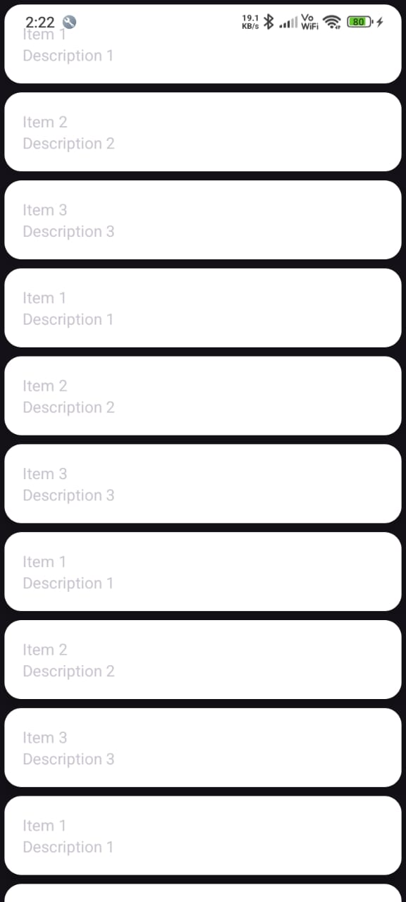
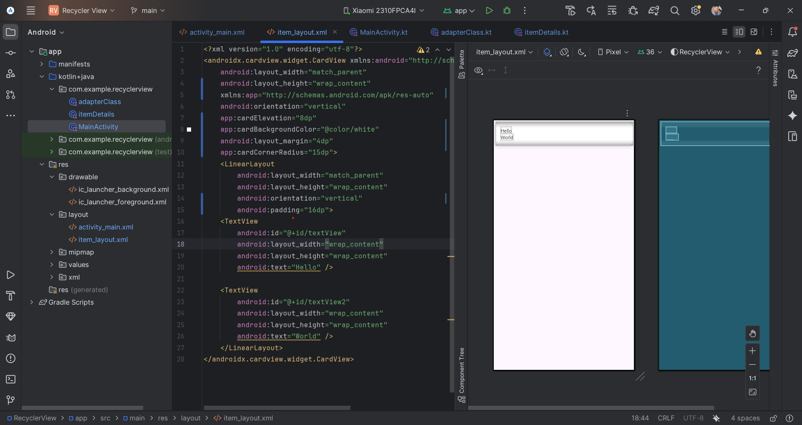

# 📱 RecyclerView Demo App

A simple and elegant Android application built to demonstrate the **functionality of RecyclerView** — one of the most powerful and flexible components in Android development.  
This project showcases how to display a dynamic list of items efficiently with a **modern UI design** and clean code architecture.

---

## 🚀 Features

- 📋 **RecyclerView Implementation** – Displays a list of items efficiently.  
- 🧩 **ViewHolder Pattern** – Optimized memory usage for smooth scrolling.  
- 🎨 **Material Design UI** – Clean, simple, and user-friendly interface.  
- ⚙️ **Adapter Integration** – Demonstrates how to bind data to RecyclerView using a custom adapter.  
- 🔁 **Dynamic Data Display** – Easily adaptable to show different types of data or layouts.  

---

## 🛠️ Tech Stack

- **Language:** Kotlin / Java (based on your code)  
- **IDE:** Android Studio  
- **Minimum SDK:** 21 (Android 5.0 Lollipop)  
- **Components Used:**
  - RecyclerView  
  - CardView  
  - ConstraintLayout  

---

## 📂 Project Structure

RecyclerViewDemo/

│

├── app/

│ ├── src/

│ │ ├── main/

│ │ │ ├── java/... (App Logic)

│ │ │ ├── res/... (Layouts, Drawables)

│ ├── screenshots/

│ │ ├── 1.jpeg

│ │ └── 2.jpeg

│

└── README.md


---

## 🖼️ Screenshots

| App UI Preview | RecyclerView Example |
|:---------------:|:--------------------:|
|  |  |

---

## 💡 How It Works

1. **RecyclerView** is initialized in the main activity.  
2. A **custom adapter** binds a list of data (like names, images, or items) to the RecyclerView.  
3. The **ViewHolder** handles each item’s layout efficiently.  
4. Smooth scrolling and performance are maintained even with a large dataset.

---

## 🧠 Learning Outcome

This project helps you understand:
- How RecyclerView replaces ListView with more flexibility.
- How to implement adapters and view holders.
- How to manage layouts and data efficiently in Android.

---

Got it ✅ You want that final section (from **“Clone this repository”** to **“Show Some Love”**) written cleanly in **Markdown code format** — so you can paste it directly into your README.

Here’s the perfectly formatted version 👇

---

````markdown
## ⚡ How to Run

1. **Clone this repository:**
   ```bash
   git clone https://github.com/deepakdotdevs/Basic-RecyclerView-Android
````

2. **Open in Android Studio**
3. **Sync Gradle files** and click ▶️ **Run**

---

## 👨‍💻 Author

**Deepak Jangid**
📍 *B.Tech CSE | Aspiring Android Developer*

🌐 Connect with me:
[💼 LinkedIn](https://www.linkedin.com/in/deepak-jangid-89954a317/) • [🎥 YouTube](https://www.youtube.com/@DreamHustleWithDeepak) • [🐙 GitHub](https://github.com/deepakdotdevs)

---

## ⭐ Show Some Love

If you found this project helpful, don’t forget to **star ⭐ the repository** — it motivates me to build and share more awesome projects like this!
